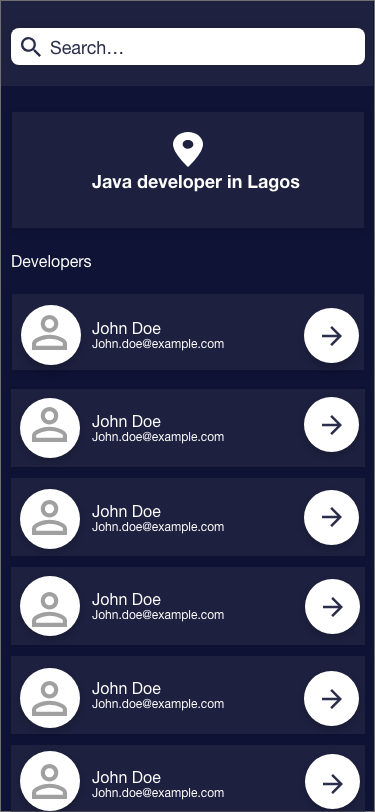
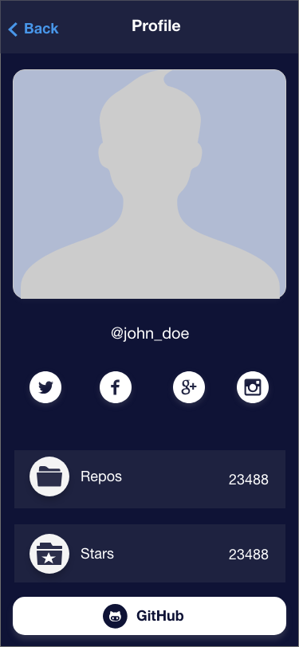
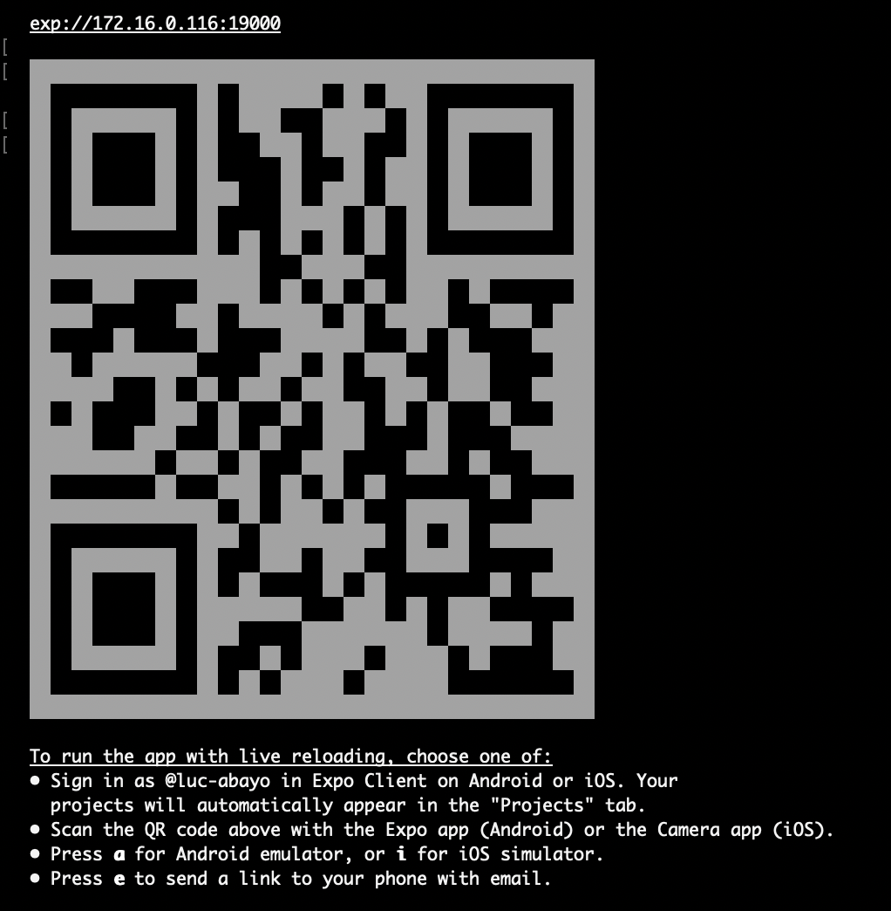

### QuoteLab mobile app

QuoteLab is an Android and IOS app build with React Native which display the list of Popular saying and Quotes.

### Screens

### Steps to build the app:

- install Expo client on your device (Android or ios)
- make sure you installed [Node.js](http://nodejs.org/)
- install Expo-cli `npm install -g expo-cli` or
- install create-react-native-app `npm install -g create-react-native-app`

### For development:

- run the following command to install dependencies `npm install`
- run the following commend for test `npm test`
- run the following command to start the app `expo start` or `npm start`

On Android open your Expo client to scan the QR code in your terminal:

For more information visit the [React Native Documentation](https://facebook.github.io/react-native/docs/getting-started) .
